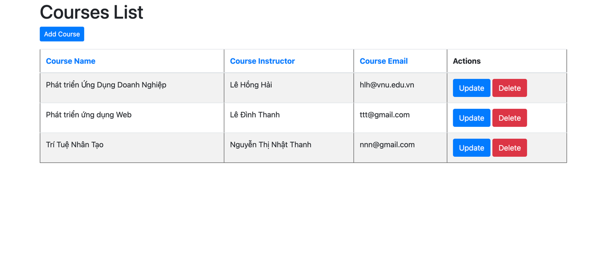
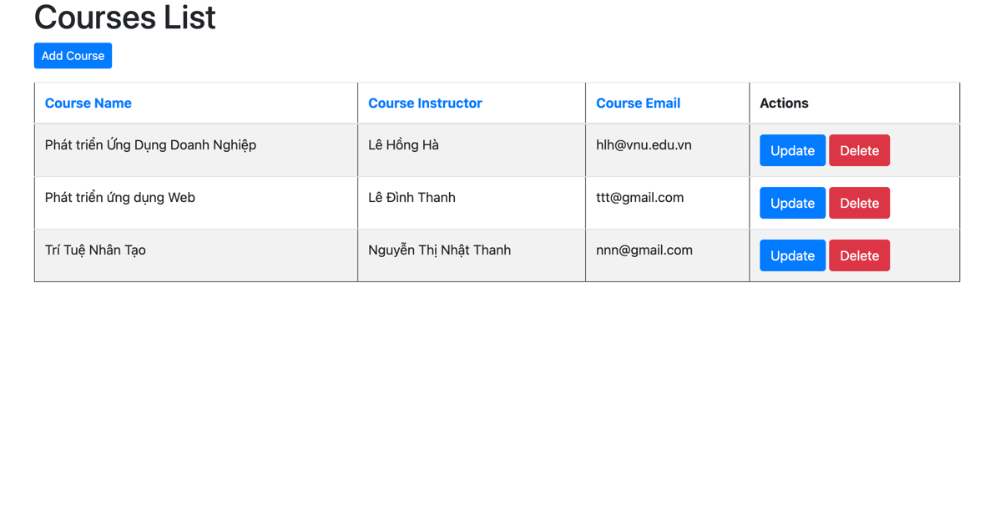
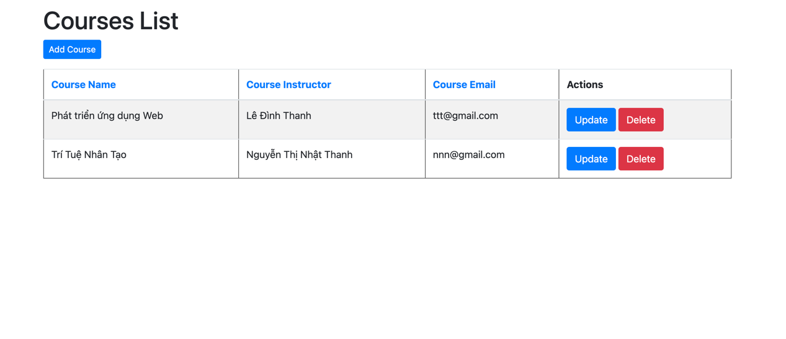

# SpringBoot-MVC-CRUD
>CRUD là viết tắt của Create (Tạo), Read/Retrieve (Đọc/Lấy dữ liệu), Update (Cập nhật) và Delete (Xóa). Đây là bốn thao tác cơ bản để xây dựng bất kỳ loại dự án nào.

Spring MVC là một Web MVC Framework dùng để phát triển ứng dụng web. Nó là một module của Spring, tương tự như Spring Boot, Spring Security, v.v.

Thuật ngữ MVC là viết tắt của Model-View-Controller, một kiến trúc phần mềm phổ biến.
Ví dụ sẽ xây dựng một ứng dụng CRUD đơn giản để theo dõi khóa học, tập trung vào module Spring MVC.
## Trang chủ

## Hoạt động CRUD

### Tạo khóa học

### Danh sách khóa học được thêm

### Cập nhật khóa học

### Khóa học được cập nhật thành công

### Xóa khóa học
